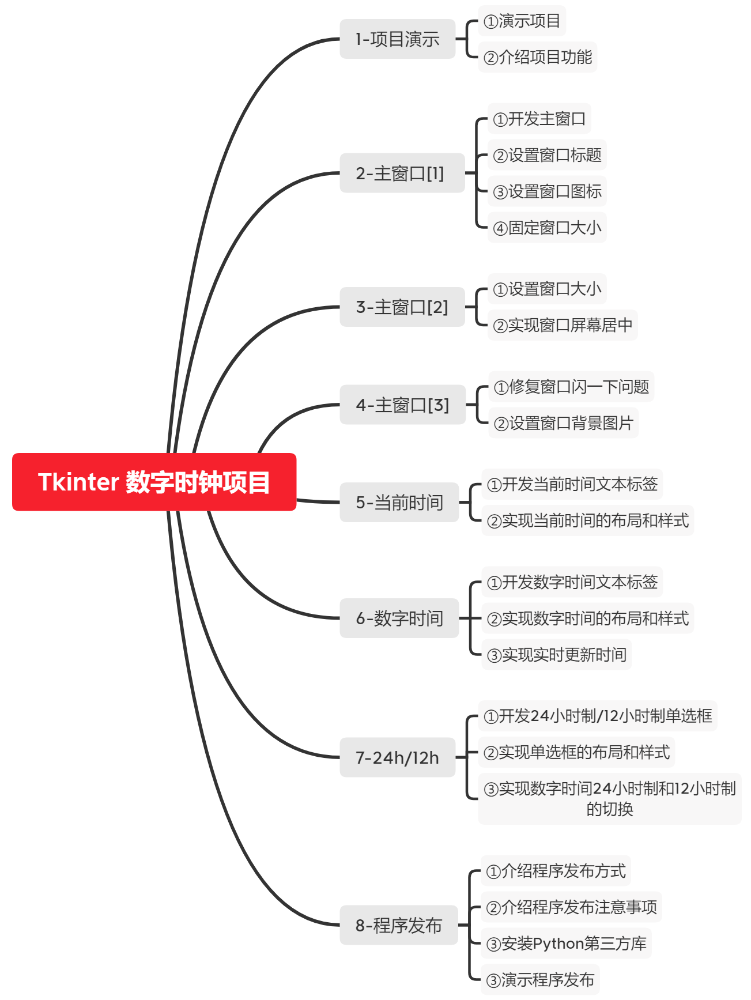
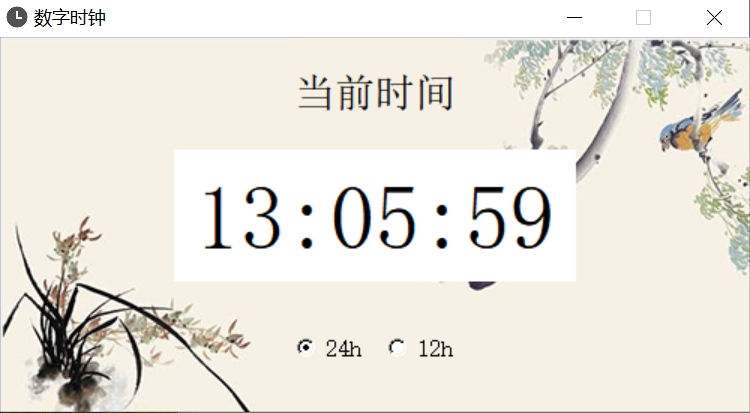

Python Tkinter 数字时钟项目
==================

课程介绍
---------

Tkinter练手项目少？没实现过完整Tkinter项目？来试试本课程吧。

本课程会一步一步带大家实现一个数字时钟项目，主要内容有

①窗口标题、图标、大小设置；  
②窗口屏幕居中；  
③窗口背景图片设置；  
④窗口布局和样式设置；  
⑤数字时间实时更新；  
⑥24小时/12小时制切换；  
⑦程序发布。  

课程内容
---------

项目截图
---------

